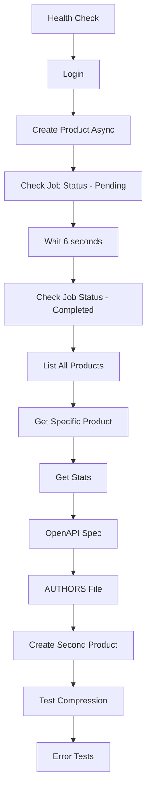

# 📬 Colecciones de Postman para Fudo Challenge API

Esta carpeta contiene las colecciones completas de Postman para probar toda la funcionalidad de la API del Fudo Challenge.

## 📁 Archivos Incluidos

- **`Fudo_Challenge_API.postman_collection.json`** - Colección principal con 15 tests completos
- **`Fudo_Challenge_Environment.postman_environment.json`** - Ambiente con variables predefinidas
- **`README.md`** - Esta documentación

## 🚀 Inicio Rápido

### 1. Importar en Postman

1. Abre Postman
2. Click en **Import**
3. Arrastra ambos archivos JSON o usa **Upload Files**
4. Verifica que se importaron correctamente

### 2. Configurar el Ambiente

1. En Postman, selecciona el ambiente **"Fudo Challenge Environment"**
2. Verifica que `base_url` apunte a `http://localhost:9292`
3. Las demás variables se auto-completarán durante las pruebas

### 3. Ejecutar la API

Asegúrate de que la API esté corriendo:

```bash
# Opción 1: Docker (recomendado)
docker-compose up

# Opción 2: Local
bundle exec rackup -p 9292
```

### 4. Ejecutar las Pruebas

**Ejecución Manual:**
- Ejecuta los requests en orden secuencial (1-15)
- Cada request tiene tests automáticos incluidos

**Ejecución Automatizada:**
- Click en la colección > **Run collection**
- Configura delay entre requests: **1 segundo**
- Click **Run Fudo Challenge API**

## 📋 Tests Incluidos

### 🏥 **1. Health Check**
- ✅ Verifica que la API esté funcionando
- ✅ Valida estructura de respuesta
- ✅ Mide tiempo de respuesta

### 🔐 **2. Authentication - Login**
- ✅ Autentica con credenciales válidas
- ✅ Guarda `session_id` automáticamente
- ✅ Valida formato del token
- ✅ Verifica expiración

### 🚫 **2b. Authentication - Invalid Credentials**
- ✅ Prueba credenciales incorrectas
- ✅ Valida error 401
- ✅ Verifica mensaje de error

### 📦 **3. Create Product (Async) - Valid**
- ✅ Crea producto asíncronamente
- ✅ Verifica status 202 (Accepted)
- ✅ Guarda `job_id` automáticamente
- ✅ Valida tiempo estimado de completación

### 🔒 **3b. Create Product - No Auth**
- ✅ Prueba crear sin autenticación
- ✅ Valida error 401
- ✅ Verifica mensaje de error

### ⏳ **4. Check Job Status - Pending**
- ✅ Verifica estado inmediato del job
- ✅ Valida estructura de respuesta
- ✅ Confirma status válido

### ✅ **5. Wait and Check Job Status - Completed**
- ✅ Espera 6 segundos automáticamente
- ✅ Verifica que el job se completó
- ✅ Guarda `product_id` automáticamente
- ✅ Confirma que el producto fue creado

### 📊 **6. List All Products**
- ✅ Lista todos los productos
- ✅ Encuentra nuestro producto creado
- ✅ Valida estructura de respuesta
- ✅ Verifica contador total

### 🎯 **7. Get Specific Product**
- ✅ Obtiene producto por ID
- ✅ Valida detalles del producto
- ✅ Confirma estructura correcta

### 📈 **8. Get System Stats**
- ✅ Obtiene estadísticas del sistema
- ✅ Valida contadores de productos y jobs
- ✅ Verifica tipos de datos

### 📖 **9. OpenAPI Specification**
- ✅ Obtiene especificación completa
- ✅ Valida headers de no-cache
- ✅ Confirma formato YAML
- ✅ Verifica contenido OpenAPI

### 👨‍💻 **10. AUTHORS File**
- ✅ Obtiene información del autor
- ✅ Valida headers de cache (24h)
- ✅ Confirma formato text/plain
- ✅ Verifica contenido

### 🔄 **11. Create Multiple Products**
- ✅ Crea segundo producto
- ✅ Verifica concurrencia
- ✅ Valida job_id diferente

### 🗜️ **12. Test Gzip Compression**
- ✅ Solicita compresión gzip
- ✅ Verifica headers de compresión
- ✅ Confirma respuesta válida

### ❌ **13. Invalid Job ID**
- ✅ Prueba con job_id inválido
- ✅ Valida error 404
- ✅ Verifica mensaje de error

### 🚨 **14. Missing Product Name**
- ✅ Prueba sin campo requerido
- ✅ Valida error 400
- ✅ Verifica validación

### 💥 **15. Invalid JSON**
- ✅ Prueba JSON malformado
- ✅ Valida error 400
- ✅ Verifica manejo de errores

## 🎯 Flujo de Pruebas Completo



## 🔧 Variables Automáticas

Las siguientes variables se establecen automáticamente durante las pruebas:

| Variable | Descripción | Se establece en |
|----------|-------------|-----------------|
| `session_id` | Token de autenticación | Login exitoso |
| `job_id` | ID del job de creación | Create Product |
| `product_id` | ID del producto creado | Job completed |

## 🚀 Ejecutión Avanzada

### Collection Runner

Para ejecutar toda la suite automatizada:

1. Click derecho en la colección
2. **Run collection**
3. Configuración recomendada:
   - **Iterations**: 1
   - **Delay**: 1000ms (1 segundo)
   - **Keep variable values**: ✅
   - **Run collection**: ✅

### Newman (CLI)

También puedes ejecutar con Newman desde línea de comandos:

```bash
# Instalar Newman
npm install -g newman

# Ejecutar colección
newman run Fudo_Challenge_API.postman_collection.json \
  -e Fudo_Challenge_Environment.postman_environment.json \
  --delay-request 1000 \
  --reporters cli,html \
  --reporter-html-export report.html
```

## 📊 Reportes

Después de ejecutar las pruebas verás:

- ✅ **Tests passed**: Número de tests exitosos
- ❌ **Tests failed**: Número de tests fallidos
- 📊 **Request count**: Total de requests ejecutados
- ⏱️ **Total time**: Tiempo total de ejecución

## 🔍 Troubleshooting

### API no responde
```bash
# Verificar que Docker esté corriendo
docker-compose ps

# Verificar logs
docker-compose logs api

# Reiniciar si es necesario
docker-compose restart
```

### Tests fallan
- ✅ Verifica que `base_url` sea correcta
- ✅ Asegúrate de ejecutar en orden secuencial
- ✅ Revisa que la API esté completamente iniciada
- ✅ Verifica credenciales en el environment

### Variables no se establecen
- ✅ Ejecuta los requests en orden
- ✅ Verifica que el ambiente esté seleccionado
- ✅ Revisa los test scripts en cada request

## 📞 Soporte

Si encuentras algún problema:

1. Revisa los logs de la API
2. Verifica la documentación en el README principal
3. Consulta la especificación OpenAPI en `/openapi.yaml`

---

**¡Listo para probar la API completa del Fudo Challenge! 🚀**
